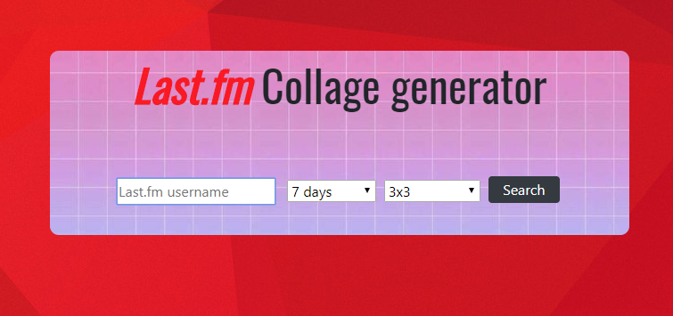

<h1 align="center">Last.fm Collage Generator</h1>
<p align="center"><i>Generates an album "Grid" based on the time a last.fm user listened to music</i></p>

## Prerequisites

Bibliotecas necessárias para rodar:
* Axios →  ```npm install axios``` 

## Design
<i>Bootstrap 4 only</i>

## Searching for a user

<p>(Here you can first set a <a href="https://www.last.fm/">last.fm</a> username, then you need to choose a date (Ex. 1 month, 7 days..) and finally you choose the size of the grid that you want to see)</p>

## Example of an album grid 3X3


## Built With

* [Bootstrap](https://getbootstrap.com/) 
* [LastAPI](https://www.last.fm/api/?lang=pt&)

## Authors

* **Antonio Mello Babo**  - [Mello](https://github.com/MelloTonio)
